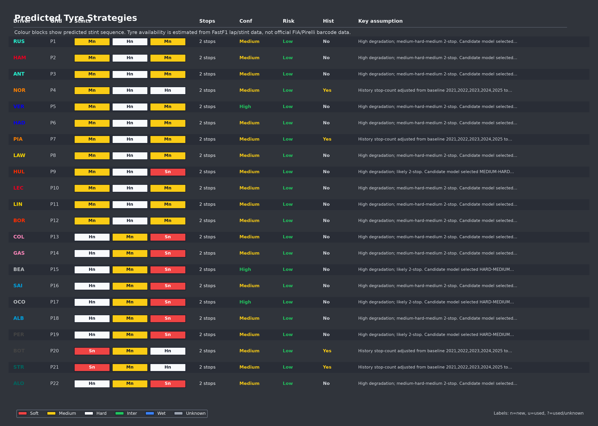
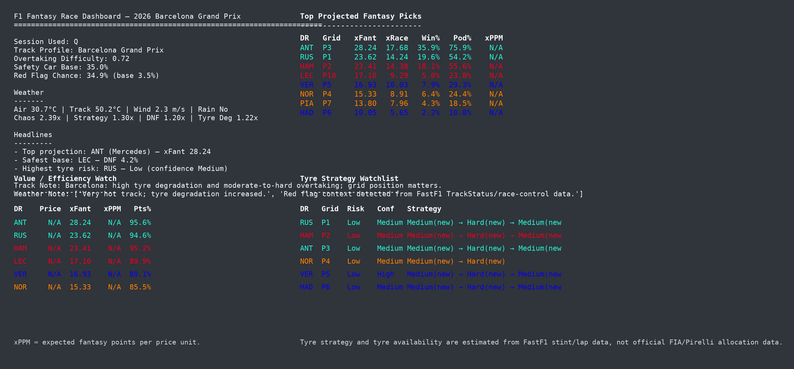
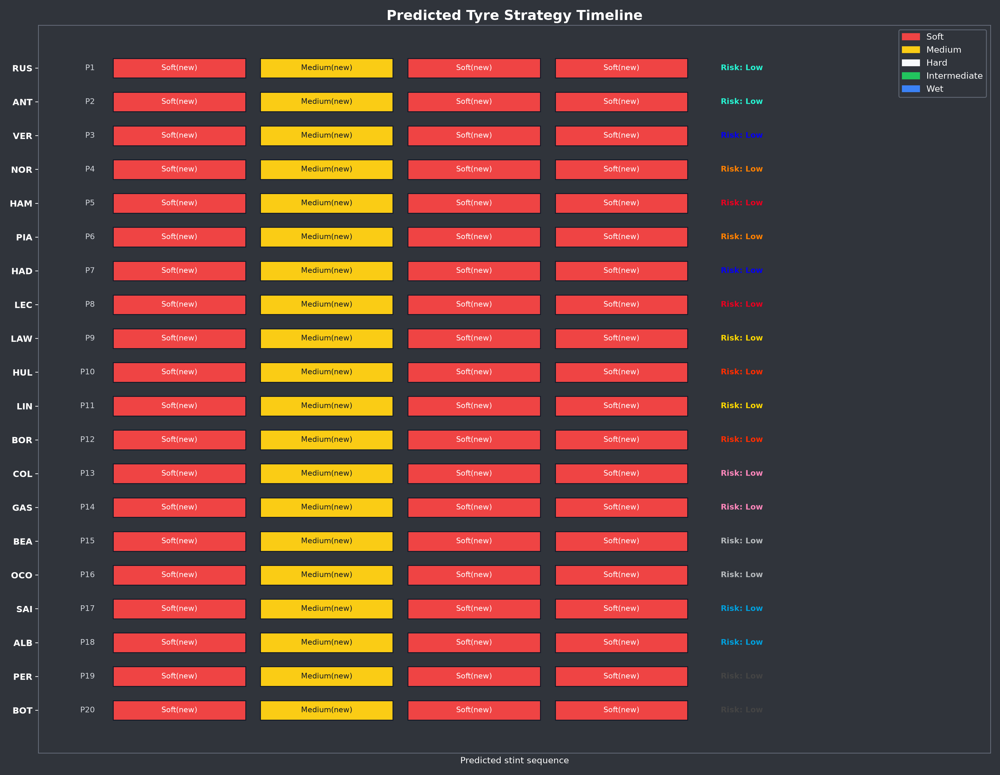
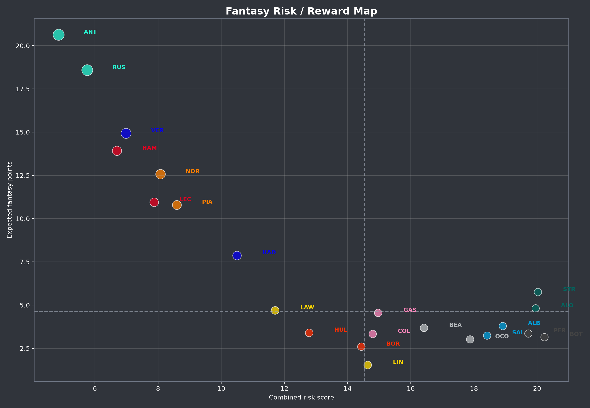
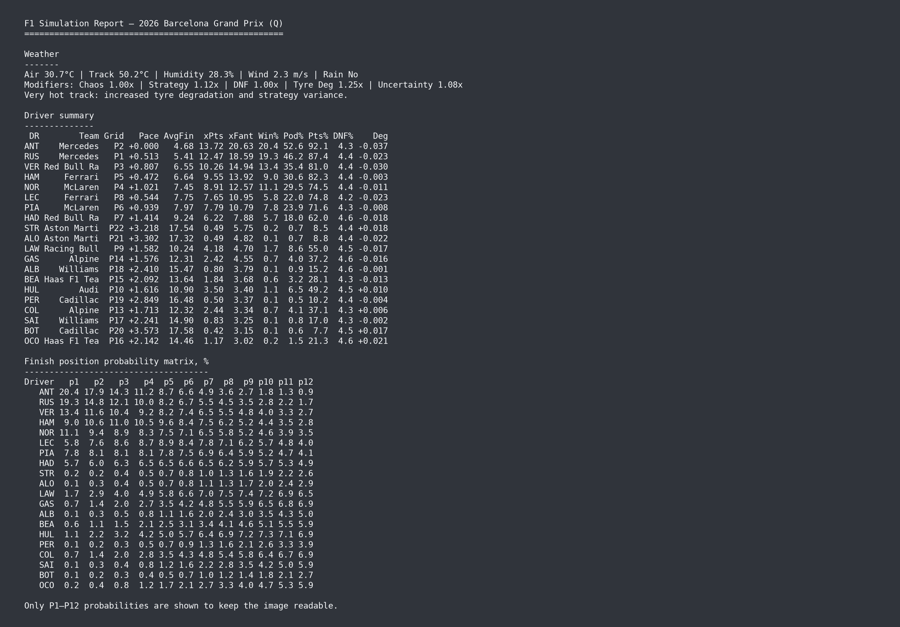
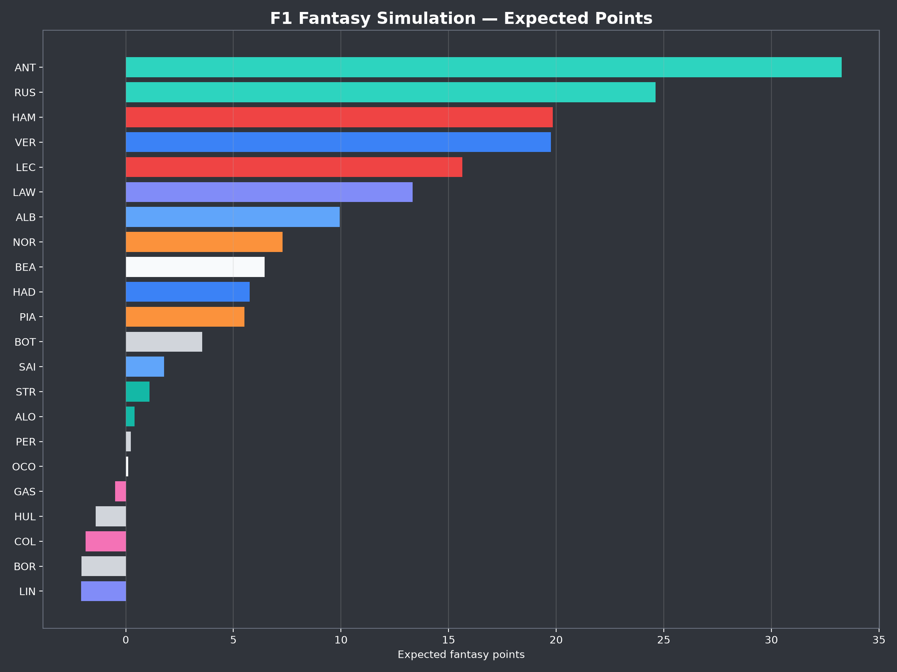

# F1 Simulation and Fantasy Model

## Project overview

This repository runs an end-to-end Formula 1 simulation pipeline using FastF1 session data.
It builds driver pace features, blends current-session and recent race baselines, simulates race outcomes, computes fantasy scoring, predicts tyre strategy risk, and generates report images and CSV outputs.

The project is Python-based.
There is no Power BI custom visual implementation in this repository (no `pbiviz.json`, `capabilities.json`, or `src/visual.ts`).

## What the model does

Main workflow in `main.py`:

1. Load the latest usable session for the target year (prefers `Q`, then `SQ`, `S`, `FP3`, `FP2`, `FP1`).
2. Export weekend lap details across available sessions.
3. Infer estimated tyre set usage from lap/stint behavior.
4. Load track profile assumptions (`data/track_profiles.csv`).
5. Build weather modifiers from session weather data.
6. Build current-session driver features and baseline race features.
7. Blend features into model features and add grid position logic.
8. Infer team/power-unit reliability from recent race result statuses.
9. Add separated performance profile columns for quali, race, strategy, reliability, and projected lap-time signals.
10. Run Monte Carlo race simulations.
11. Compute fantasy scoring and optional value metrics (`xPPM`) if prices are provided.
12. Predict tyre strategies and optionally adjust them with historical same-event race baselines.
13. Save prediction snapshots for later backtesting.
14. Generate report charts, simulated race-time visualization, and commentary.
15. Optionally post a report bundle to Discord.

## Data fields and inputs

### FastF1 inputs

Pulled at runtime via FastF1:

- Session laps (`session.laps`)
- Session weather (`session.weather_data`)
- Session classification/results (`session.results` when available)
- Event schedule

### Local model inputs

- Team/power-unit mapping (`data/team_power_units.csv`) for reliability inference.

### Local input files

- `data/fantasy_prices.csv`
	- Required columns for value calculations: `Driver`, `Team`, `fantasy_price`
	- If missing, `main.py` creates a template file and value chart/`xPPM` is skipped until prices are filled.
- `data/track_profiles.csv`
	- Created automatically if missing.
	- Used fields: `Event`, `OvertakingDifficulty`, `SafetyCarChance`, `RedFlagBaseChance`, `Notes`
- `data/fia_documents/fia_document_index.csv`
	- Optional local index for official FIA context.
	- Official starting grid rows override qualifying/model grid assumptions when available.
	- Penalty rows are carried into grid outputs as FIA penalty notes.
- `.env`
	- `POST_TO_DISCORD=true` enables Discord posting.
	- `DISCORD_WEBHOOK_URL=...` required when posting is enabled.

## Setup

### 1) Create and activate a virtual environment (recommended)

Windows PowerShell:

```powershell
python -m venv .venv
.\.venv\Scripts\Activate.ps1
```

### 2) Install dependencies

```powershell
pip install -r requirements.txt
```

### 3) Optional: install development dependencies

```powershell
pip install -r requirements-dev.txt
```

## Development and run commands

### Run the full simulation pipeline

```powershell
python main.py
```

Runtime parameters are loaded from `config/default_run_config.json`.
You can override common settings with CLI flags:

```powershell
python main.py --year 2026 --event latest --session Q --n-sims 50000
```

Useful flags:

- `--config` for a custom JSON config file.
- `--year`, `--event`, `--session`.
- `--n-sims`, `--seed`, `--baseline-races`.
- `--default-overtaking-difficulty`, `--strategy-lookback-years`.
- `--post-to-discord` / `--no-discord`.

Weather handling:

- FastF1 session weather is used when available.
- If session weather is missing, the app can fall back to Open-Meteo forecast data using `Latitude` and `Longitude` from `data/track_profiles.csv`.
- Forecast fallback is controlled by `model.use_weather_forecast` in `config/default_run_config.json`.

Environment overrides are also supported for:

- `F1_SIM_YEAR`
- `F1_SIM_EVENT`
- `F1_SIM_SESSION`
- `F1_SIM_N_SIMS`
- `F1_SIM_RANDOM_SEED`
- `POST_TO_DISCORD`

### Parameter reference

The project uses a mix of JSON config, editable CSV data, and code-level model constants.
This section groups the main parameters by purpose so changes are easier to reason about.

#### Run selection and simulation volume

Defined in `config/default_run_config.json` under `run`.

| Parameter | Purpose |
| --- | --- |
| `year` | F1 season to load. |
| `event` | Event name, round number, or `latest` for automatic session selection. |
| `session` | Preferred session code such as `FP2`, `FP3`, `Q`, `SQ`, `S`, or `R`. |
| `n_sims` | Monte Carlo race count. Higher values are slower but smoother. |
| `random_seed` | Reproducibility seed for simulation randomness. |
| `n_baseline_races` | Number of recent races used for pace and reliability baselines. |
| `default_overtaking_difficulty` | Fallback track-position difficulty if no track profile is found. |
| `historical_strategy_lookback_years` | Same-event history window used by tyre strategy adjustment. |

#### Output toggles

Defined in `config/default_run_config.json` under `outputs`.

| Parameter | Purpose |
| --- | --- |
| `output_dir` | Root folder for generated CSVs, images, debug files, and reports. |
| `save_prediction_snapshot` | Writes a prediction snapshot for future backtesting. |
| `save_report_images` | Enables polished report image generation. |
| `save_raw_results` | Saves raw simulation and fantasy rows. |
| `post_to_discord` | Sends the report bundle when Discord webhook settings are available. |

#### Data source paths

Defined in `config/default_run_config.json` under `data`.

| Parameter | Purpose |
| --- | --- |
| `fantasy_prices_path` | Driver/team fantasy price input. |
| `track_profiles_path` | Track overtaking, safety-car, red-flag, coordinate, and note assumptions. |
| `fia_document_index_path` | FIA grid, penalty, summons, and classification context. |
| `team_power_units_path` | Team-to-power-unit mapping for inferred engine/car reliability. |

#### Model feature switches

Defined in `config/default_run_config.json` under `model`.

| Parameter | Purpose |
| --- | --- |
| `model_version` | Label written into model outputs. |
| `use_fastf1_weather` | Keeps FastF1 weather enabled where supported. |
| `use_weather_forecast` | Allows Open-Meteo fallback when session weather is missing. |
| `use_race_control_context` | Allows race-control signals to influence weather/chaos modifiers. |
| `use_track_red_flag_base_chance` | Uses track-specific red-flag baseline chance in simulation. |

#### Editable data tables

| File | Main parameters |
| --- | --- |
| `data/track_profiles.csv` | `OvertakingDifficulty`, `SafetyCarChance`, `RedFlagBaseChance`, `Latitude`, `Longitude`. |
| `data/team_power_units.csv` | `Year`, `Team`, `PowerUnitSupplier`; used for team and engine reliability inference. |
| `data/fantasy_prices.csv` | Fantasy prices used for value/xPPM outputs. |
| `data/fia_documents/fia_document_index.csv` | Official grid, penalty, classification, summons, and note fields. |

#### Session weighting and pace blending

Defined mainly in `src/model.py`, `src/performance.py`, and `src/model_config.py`.

| Parameter/group | Purpose |
| --- | --- |
| `CURRENT_SESSION_WEIGHTS` | Controls how much current session data affects the blended model by session type. |
| `SESSION_WEIGHTS` | Splits current-session influence across quali, race, and strategy scores. |
| `baseline_weight = 1 / (1 + baseline_age * 0.45)` | Downweights older baseline races. |
| `current_signal_quality` | Scales current-session influence using clean laps, lap variance, and outlier checks. |
| Practice pace cap | Limits bad practice runs to reduce overreaction to fuel, traffic, and run plans. |
| Qualifying pace cap | Keeps quali signals strong but bounded. |
| `model_uncertainty` | Built from baseline spread, low baseline coverage, session type, and current signal quality. |

#### Weather and race-control modifiers

Defined mainly in `src/weather.py` and `src/race_control.py`.

| Parameter/group | Purpose |
| --- | --- |
| `chaos_factor` | Increases race noise, safety-car/red-flag risk, and variance. |
| `strategy_factor` | Increases strategy loss/noise when conditions are uncertain. |
| `dnf_factor` | Scales simulated DNF probability. |
| `degradation_factor` | Scales tyre degradation loss and strategy assumptions. |
| `uncertainty_factor` | Scales race noise. |
| Rainfall flag | Adds chaos, strategy variance, DNF risk, and uncertainty. |
| Track temperature thresholds | Increase or reduce tyre degradation and uncertainty. |
| Wind thresholds | Increase chaos and uncertainty for moderate/high wind. |
| Race-control context | Raises chaos, strategy, DNF, and uncertainty factors from incidents/messages. |

#### Reliability and DNF parameters

Defined mainly in `src/features.py`, `src/reliability.py`, `src/performance.py`, and `src/simulate.py`.

| Parameter/group | Purpose |
| --- | --- |
| Feature `dnf_prob` | Starts from lap-data quality: base risk plus low-clean-lap and noisy-lap penalties. |
| `DEFAULT_MECHANICAL_DNF_RATE = 0.045` | Reliability prior when recent result status data is sparse. |
| `DEFAULT_PRIOR_WEIGHT = 8.0` | Smoothing weight for team and power-unit DNF rates. |
| Mechanical status keywords | Classify statuses like engine, gearbox, hydraulics, brakes, and power unit as mechanical DNFs. |
| Non-mechanical status keywords | Classify accidents, collisions, crashes, and similar statuses separately. |
| Reliability blend | Combines base `dnf_prob`, team mechanical DNF rate, and power-unit mechanical DNF rate. |
| `reliability_score` | Final DNF probability signal passed into the simulation engine. |
| `effective_dnf_prob` | Simulation DNF probability after weather/race-control `dnf_factor`, clipped to a safe range. |
| DNF time penalty | Adds a large classified-time penalty for simulated DNFs. |

#### Race simulation engine

Defined in `src/model_config.py` under `SIMULATION_PARAMETERS`.

| Parameter | Purpose |
| --- | --- |
| `race_pace_seconds_multiplier` | Converts race pace score into time loss. |
| `long_run_penalty_multiplier` | Penalizes weak long-run pace versus race pace. |
| `tyre_deg_multiplier` | Converts tyre degradation score into race time loss. |
| `grid_loss_multiplier` | Converts grid position and overtaking difficulty into time loss. |
| `strategy_loss_multiplier` | Converts strategy score into time loss. |
| `race_noise_multiplier` | Driver/race stochastic pace noise. |
| `start_noise_seconds` | Start phase randomness. |
| `strategy_noise_seconds` | Strategy randomness. |
| `chaos_noise_seconds` | Incident/weather chaos randomness. |
| `red_flag_field_compression` | Compresses field spread under simulated red flags. |
| `red_flag_noise_seconds` | Adds noise after red-flag compression. |

#### Fantasy scoring

Defined in `src/model_config.py` under `FANTASY_SCORING`.

| Parameter/group | Purpose |
| --- | --- |
| `finish_points` | Points by classified race finish. |
| `quali_points` | Points by qualifying position. |
| `position_gain_points_per_place` | Reward for race positions gained. |
| `position_loss_points_per_place` | Penalty for positions lost. |
| `position_change_min` / `position_change_max` | Caps position-change scoring. |
| `fastest_lap_bonus` | Fastest lap fantasy bonus. |
| `dotd_bonus` | Driver of the day fantasy bonus. |
| `dnf_penalty` | Fantasy DNF penalty. |

#### Tyre strategy parameters

Defined mainly in `src/tyres.py`, `src/strategy.py`, and `src/strategy_history.py`.

| Parameter/group | Purpose |
| --- | --- |
| Assumed dry tyre allocation | Starting hard/medium/soft sets by weekend format. |
| Tyre status classification | Estimates new, scrubbed, used, or unknown sets from FreshTyre and TyreLife. |
| Inventory risk score | Combines shortage pressure, unknown stints, and confidence penalties. |
| Degradation source fallback | Driver long-run, team long-run, field long-run, then weather-adjusted default. |
| Candidate strategy scoring | Ranks dry plans such as medium-hard, hard-medium, soft-hard, and two-stop variants. |
| High degradation threshold | Pushes strategy selection toward two-stop candidates. |
| Overtaking difficulty thresholds | Reward track-position preservation or recovery strategies depending on circuit. |
| Old/unknown tyre penalty | Penalizes strategies that likely need used or unknown dry sets. |
| Historical adjustment thresholds | Uses same-event history only when sample size and signal strength are high enough. |

#### Backtest and calibration

Defined mainly in `src/model_config.py`, `src/backtest.py`, and `src/calibration.py`.

| Parameter/group | Purpose |
| --- | --- |
| `BACKTEST_METRIC_WEIGHTS` | Weights finish MAE, Brier scores, and fantasy MAE in backtest review. |
| Backtest snapshots | Saved predictions later compared against actual results. |
| Calibration recommendations | Reads backtest metrics and suggests model-parameter tuning changes. |

### Race weekend workflow

Use `--event latest` when you want the app to choose the best available predictor session automatically.
The automatic priority is qualifying first, then sprint sessions, then practice: `Q`, `SQ`, `S`, `FP3`, `FP2`, `FP1`.

Use a specific event name or round number when you want to force a particular session:

```powershell
python main.py --year 2026 --event "Barcelona Grand Prix" --session FP2 --n-sims 5000 --no-discord
```

Recommended weekend rhythm:

| Weekend point | What to run | Why |
| --- | --- | --- |
| Before FP1 | `python main.py --event latest --n-sims 1000 --no-discord` | Smoke-test dependencies, cache, config, prices, and output folders before useful session data exists. |
| After FP1 | `python main.py --event latest --n-sims 5000 --no-discord` | Create an early, low-confidence read and catch missing data issues. |
| After FP2 | `python main.py --event latest --n-sims 10000 --no-discord` | First useful long-run/fantasy direction; review tyre and pace outputs. |
| After FP3 | `python main.py --event latest --n-sims 20000 --no-discord` | Final practice-based check before qualifying changes the grid signal. |
| After Q or SQ | `python main.py --event latest --n-sims 50000 --no-discord` | Main pre-race prediction using the strongest available predictor session. |
| After official grid/penalties | Update `data/fia_documents/fia_document_index.csv`, then rerun `python main.py --event latest --n-sims 50000 --no-discord` | Apply FIA-confirmed grid and penalty context before publishing. |
| Final pre-race post | `python main.py --event latest --n-sims 50000 --post-to-discord` | Publish the report bundle once prices, grid assumptions, and outputs look right. |
| After the race | `python -m src.backtest` | Compare the saved prediction snapshot against actual results. |
| After backtest | `python -m src.calibration` | Generate advisory model-parameter tuning recommendations. |

For sprint weekends, run the same flow after `SQ` and again after `S` if sprint data should influence the race read.
Do not run `python -m src.backtest` until FastF1 race results are available.

### Run the desktop GUI

```powershell
python app_gui.py
```

The GUI wraps the same simulation pipeline as `main.py`.
It lets you set the year, event, session, simulation count, output folder, output toggles, and Discord posting before starting a run.
The run log is streamed into the app window.

### Run the portable app MVP

The portable app MVP is a richer dashboard shell based on the mockups in `docs/mockups/portable-app/`.
It currently includes:

- Race setup and run controls.
- Data-source validation and CSV preview.
- Background simulation execution with a run log.
- Results/output browser for generated CSVs and report files.
- Placeholders for Model Signals, Weather & Reliability, Tyre Strategy, Fantasy, Compare, and Settings.

Install runtime dependencies, then launch:

```powershell
pip install -r requirements.txt
python -m portable_app.main
```

This app is intentionally separate from `app_gui.py`, which remains the lightweight Tkinter runner.

### Build a Windows GUI executable

Install development dependencies first:

```powershell
pip install -r requirements-dev.txt
```

Then build the GUI app:

```powershell
.\scripts\build_windows_gui_exe.ps1
```

The build output is written to:

```text
dist\F1SimGUI\F1SimGUI.exe
```

The first packaged version is a folder-style app, not a single-file installer.
Keep the generated `dist\F1SimGUI` folder together when sharing it.

### Build the portable app executable

Install runtime and development dependencies first:

```powershell
pip install -r requirements.txt
pip install -r requirements-dev.txt
```

Then build the portable dashboard app:

```powershell
.\scripts\build_portable_app.ps1
```

The build output is written to:

```text
dist\F1RaceSimulatorPortable\F1RaceSimulatorPortable.exe
```

### Generate data-source roadmap artifacts

```powershell
python scripts/build_data_source_roadmap.py
```

### Inspect one driver in debug output

```powershell
python explain_driver.py
```

`explain_driver.py` uses the hardcoded `DRIVER` constant and expects existing `outputs/simulation_summary.csv` and `outputs/driver_model_features.csv` files.

### Backtest latest saved prediction after a race is complete

```powershell
python -m src.backtest
```

By default this reads `outputs/history/latest_prediction_snapshot.csv` and writes comparison artifacts to `outputs/backtest`.

### Build calibration recommendations from backtests

```powershell
python -m src.calibration
```

By default this reads `outputs/backtest/*_metrics.csv` and writes:

- `outputs/calibration/calibration_report.json`
- `outputs/calibration/calibration_report.txt`

You can pass explicit metrics files or globs:

```powershell
python -m src.calibration --metrics "outputs/backtest/*_metrics.csv" --output-dir outputs/calibration
```

Calibration reports are advisory. They do not edit `src/model_config.py`; review suggested parameter changes before applying them.

## Build/package commands

This repository currently has no npm/pbiviz build or packaging workflow.
There is no `package.json`, `pbiviz.json`, or Power BI visual packaging step in the current codebase.

## Power BI data roles, field wells, and tooltips

No Power BI custom visual artifacts are present in the current repository.
That means there are currently no `capabilities.json` data roles, field wells, formatting cards, selection interactions, or tooltip definitions to document.

## Outputs

Primary generated files (non-exhaustive):

- Core model outputs
	- `outputs/current_session_features.csv`
	- `outputs/baseline_race_features.csv`
	- `outputs/driver_model_features.csv`
	- `outputs/debug/reliability_profile.csv`
	- `outputs/simulation_summary.csv`
	- `outputs/position_matrix.csv`
	- `outputs/weather_summary.csv`
	- `outputs/raw_simulation_results.csv` (when `SAVE_RAW_RESULTS=True`)
	- `outputs/raw_fantasy_results.csv` (when `SAVE_RAW_RESULTS=True`)
- Lap detail exports
	- `outputs/lap_details/weekend_lap_details.csv`
	- `outputs/lap_details/practice_lap_summary.csv`
	- `outputs/lap_details/practice_long_run_summary.csv`
	- `outputs/lap_details/quali_lap_summary.csv`
	- `outputs/lap_details/quali_results_segments.csv`
- Tyre and strategy outputs
	- `outputs/tyres/tyre_set_ledger_estimated.csv`
	- `outputs/tyres/tyre_inventory_estimated.csv`
	- `outputs/strategy/predicted_tyre_strategy.csv`
	- `outputs/strategy/predicted_tyre_strategy_history_adjusted.csv`
	- `outputs/strategy/predicted_tyre_strategy.png`
    ### Predicted tyre strategy



- Historical strategy baseline outputs
	- `outputs/history/historical_strategy_driver_runs.csv`
	- `outputs/history/historical_strategy_summary.csv`
	- `outputs/history/historical_strategy_baseline.csv`
- Report assets
	- `outputs/report/race_dashboard.png`
    ### Race dashboard



	- `outputs/report/tyre_strategy_timeline.png`
    ### Tyre strategy timeline




	- `outputs/report/fantasy_risk_reward.png`
    ### Fantasy risk/reward




	- `outputs/report/simulated_race_times.png`
	- `outputs/report/model_commentary.txt`
	- `outputs/probabilities.png`
	- `outputs/detailed_report.png`
    ### Detailed report



	- `outputs/fantasy_expected_points.png`
    ### Fantasy expected points



	- `outputs/fantasy_value.png` (only when prices are available)
- Backtest outputs
### Fantasy value


	- `outputs/history/*prediction_snapshot*.csv`
	- `outputs/history/latest_prediction_snapshot.csv`
	- `outputs/history/*prediction_snapshot*.config.json`
	- `outputs/backtest/*_actual_results.csv`
	- `outputs/backtest/*_comparison.csv`
	- `outputs/backtest/*_metrics.csv`
	- `outputs/backtest/*_recommendations.txt`

## Visual behavior and interactions

Report/plot behavior currently implemented:

- Team-colored bars and dark-theme chart/report styling across chart modules.
- Simulation summary + strategy risk are rendered into report-card images.
- Tyre strategy output ranks multiple candidate plans and exposes score, score gap, and candidate summary columns.
- Historical strategy adjustment can overwrite default tyre strategy output when same-event history indicates likely higher stop counts.
- Discord posting sends:
	- One long summary message (auto-split to respect Discord length limits)
	- Then report files as attachments.

There is no interactive UI/field-well behavior in this repository; outputs are static images and CSV files.

## Formatting options

No user-facing formatting pane exists in the current implementation.
Formatting is controlled in code (matplotlib styles, table labels, color maps, output paths).

## Known limitations

- Tyre inventory is estimated from lap data and tyre-life heuristics, not official FIA/Pirelli barcode set tracking.
- Historical strategy adjustment depends on event matching and available historical race data quality.
- If current session is practice, grid is estimated and uncertainty is intentionally increased.
- Rainfall, forecast, and weather modifiers are conservative heuristics, not a full meteorological or circuit-specific calibration model.
- Engine/car reliability is inferred from recent result statuses and editable team/power-unit mappings, not an official manufacturer reliability feed.
- Fantasy value (`xPPM`) requires valid prices in `data/fantasy_prices.csv`.

## Troubleshooting

- `DISCORD_WEBHOOK_URL is missing. Add it to your .env file.`
	- Set `DISCORD_WEBHOOK_URL` in `.env`, or keep `POST_TO_DISCORD` disabled.
- `Snapshot not found: outputs/history/latest_prediction_snapshot.csv`
	- Run `python main.py` first to create a snapshot, then run backtest.
- `No laps found for ...`
	- FastF1 may not have that session yet, or the event/session identifier is unavailable.
- Strategy files are missing
	- Check that lap detail and tyre inventory outputs were created; strategy generation is skipped when upstream data is empty.
- Fantasy value chart is skipped
	- Fill numeric `fantasy_prices` values in `data/fantasy_prices.csv`.

## Documentation guard

`scripts/check-docs-updated.ps1` is a pre-commit helper that warns when staged code/config files changed but `README.md` was not staged.
It prompts for explicit override (`y`) before allowing the commit to continue.

## Recent implementation changes

Current repository behavior includes:

- Weekend lap detail export and lap-summary outputs.
- Tyre set usage inference and estimated inventory outputs.
- Historical same-event strategy baseline adjustment.
- Structured report card image generation and textual model commentary output.
- Prediction snapshot saving and post-race backtesting utilities.
- Optional Discord report bundle posting controlled via `.env`.
